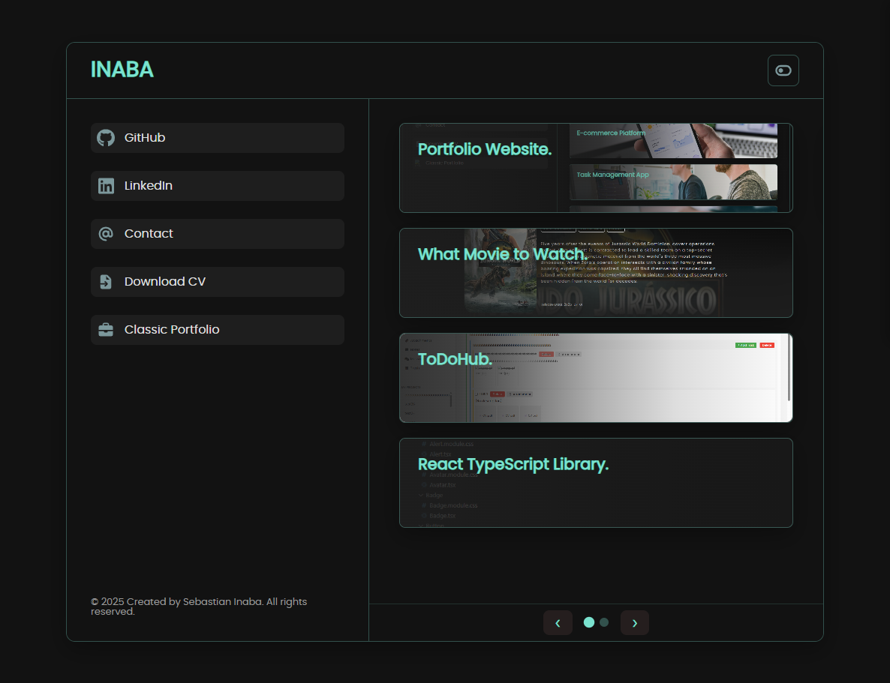

# Sebastian Inaba Portfolio

Personal portfolio built with HTML, CSS, and JS. This repository documents both the original portfolio and my new modern redesign.

---

## Project Overview

This portfolio website showcases my skills, projects, and contact info.  
The original portfolio is not completed, it lacks project entries, SEO links, and GitHub links. Still.....

The **new modern portfolio** is a full redesign that emphasizes minimalism, better usability, and responsiveness.  

---

## Design Process (New Portfolio)



The **new portfolio** aims to add more interactive features, fun elements and follow **WCAG** guidelines, here are some id like to add in the future:

- **Visitors message board** – allow visitors to leave messages.
- **Background animation toggle** – canvas, SVG paths, etc. (Currently too complex for me to implement what i want fully).
- **Custom 404 page** – for fun and improved UX.
- **Easter egg(s)** – hidden surprises for curious visitors.

The new design prioritizes interactivity, accessibility, and personalization, while keeping the clean and modern aesthetic.

---

## Design Process (Old Portfolio)

### Original Design (from Figma)


I initially designed the site with a more "complex" layout in Figma.  
I simplified it for better usability and responsiveness, as I wasn't satisfied with the original design.

### Current Live Design


The current design focuses on **minimalism** and a **clean user experience**.  
It was completely created from scratch, replacing the first portfolio.

---

## Development Process(New Portfolio)

- Code is **cleaner** with full **SEO setup** (except WebP images for now).
- CSS and classes follow **BEM** and **SMACSS** methodology.
- Fully **responsive** according to **WCAG guidelines** (tab navigation improvements in progress).
- Fully **animated** for smoother movement.
- **Light and dark mode** options for better viewing preference and whoever wants to look at the sun while navigation(light theme).

## Development Process(Old Portfolio)

- The CSS is written using the **ITCSS** (Inverted Triangle CSS) method, which helps maintain CSS structure in layers.
- Semantic **HTML5**, **Flexbox**, and **CSS Grid** are used for layout.
- Root variables define a **fixed color palette**, making the code easier to maintain.

---

## To do

- Convert images to webp
- Add hamburger to classic portfolio with a redirect button to new portfolio
- Add project links to classic portfolio
- Finnish SEO on classic portfolio
- Clean up classic portfolio code if there is anything that looks bad

---

## How to run locally

Clone the repository and open `index.html` in your browser:

```bash
git clone https://github.com/Sebastian-Inaba/Portfolio
cd portfolio
open index.html


## License
This project is licensed under the MIT License. See the LICENSE file for details.