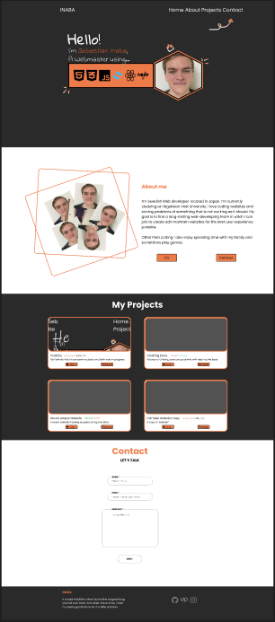
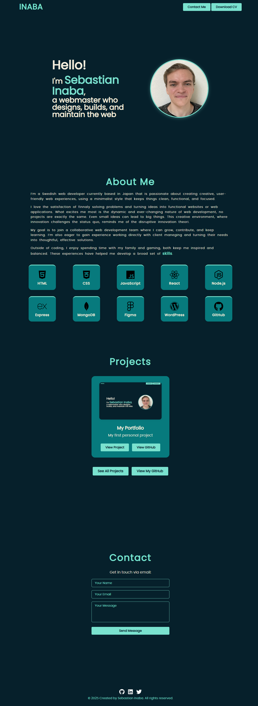

# Sebastian Inaba Portfolio
Personal portfolio built with HTML,CSS and abit of JS. 

## Project Overview
This portfolio website showcases my skills, projects, and contact info. Its not a complete portfolio since it has no projects in it, its also missing SEO links and guthub links.

## Design Process

### Original Design (from Figma)

I initially designed the site with a more "complex" layout in figma, but I simplified alot for better usability and responsiveness and i really didn't like the original design.

### Current Design

The current design focuses on minimalism and a clean user experience. It was completely created from scratch, replacing my first portfolio.

## Development Process

- The CSS is written using the **ITCSS** (Inverted Triangle CSS) method, which helps maintain structuring CSS in layers.
- I use semantic HTML5, flexbox, and CSS grid for layout
- I use root variables to define a fixed color palette, making the code easier to manage.

## How to run locally
Clone the repository and open `index.html` in your browser.

## License
This project is licensed under the MIT License. See the LICENSE file for details.
